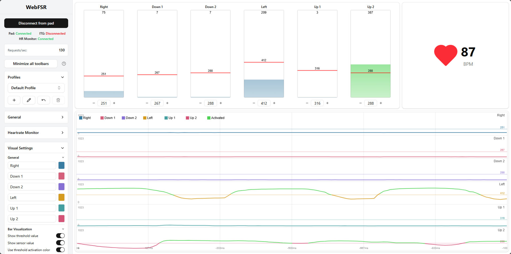
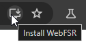

<div align="center">
  <h1 style="border-bottom: none;">WebFSR - <a href="https://webfsr.com">webfsr.com</a></h1>
</div>

<div align="center">
  <h3 style="border-bottom: none;">
    Web client for managing FSR pads running the <a href="https://github.com/teejusb/fsr">teejusb FSR firmware</a>.
  </h3>
</div>

## Features

- Connect directly to the microcontroller using WebSerial (requires a Chromium-based browser).
- View current sensor data and adjust thresholds.
- Settings to adjust the visuals of the sensor bars and the time series graph.
- Automatically save all settings and threshold values to profiles, stored using IndexedDB.
- Display heartrate monitor data using WebBluetooth.
- Installable as a PWA, allowing it to run in a dedicated window and offline.
- OBS Browser Source components of each visualization to display in recordings or streams.
- Light and dark mode.
- Control thresholds from an external mobile device.

## Screenshot



## PWA Installation

WebFSR is installable as a PWA. This will allow you to run it offline and in a separate window, which is more convenient than managing it in a browser tab.

To install it as a PWA, find a button in the top-right corner of your browser which says "Install WebFSR":



## Managing thresholds from an external device

> [!NOTE]
> Direct WebRTC connections may not always be possible on certain restrictive networks (e.g. universities, mobile). If you self-host, trystero allows adding a TURN server to proxy connections. Additionally, check your browser's WebRTC settings if the devices are failing to connect (for example, Helium Browser's #webrtc-ip-handling-policy flag needs to be set to "Default").

A mobile device can be paired to control the thresholds of the connected pad. This is completely peer-to-peer, using WebRTC for communication. 

The initial signaling handshake is done using [trystero](https://github.com/dmotz/trystero) with the BitTorrent backend, using open torrent trackers as the signaling server to match peers and exchange WebRTC SDP needed to make a connection. Per trystero documentation, all signaling communication is encrypted using the unique app and room ID. 

## OBS Browser Source Components

> [!IMPORTANT]
> Minimizing or occluding the page will likely cause the websocket connection to be heavily throttled. Until a good mitigation for this is found, bring the tab/PWA into focus, and then open ITG without focusing any other window.

Each visualization can be loaded in a separate route to display in an OBS Browser Source. This allows for high quality stream elements without resorting to using Window Capture.

This feature works by using the websocket server built into OBS. Each route connects as a client, and the main page sends data to each of the component pages through obs-websocket.

Steps to use the OBS Browser Source components:

1. Enable the OBS websocket server by going to Tools > WebSocket Server Settings > Enable WebSocket Server
2. Copy the password under Server Password
3. In the main page under the OBS section, paste the password
4. Customize a component using the "Create component" button in the OBS section
5. Copy the generated link and paste that into the source URL for an OBS Browser Source

Components are located at the route `/obs/{visualization}/`.

List of the current routes:

- `/obs/sensors/`
- `/obs/graph/`

## Future TODO

- Integration with ITGmania
   - Send real-time theme data to the client. This would allow for more in-depth statistical analysis which would support in pad debugging. For example, each miss can be sent to the client, connecting a miss in game with a specific sensor value.
   - This would be accomplished with a websocket server running locally on the machine, which will receive data from a theme module and pass it along to the client.
- Import profiles saved from teejusb FSR web UI.
## Development

### Prerequisites

- pnpm

### Setup

1. Clone the repo
2. Install dependencies:
```bash
pnpm install
```
3. Run the dev server:
```bash
pnpm dev
```